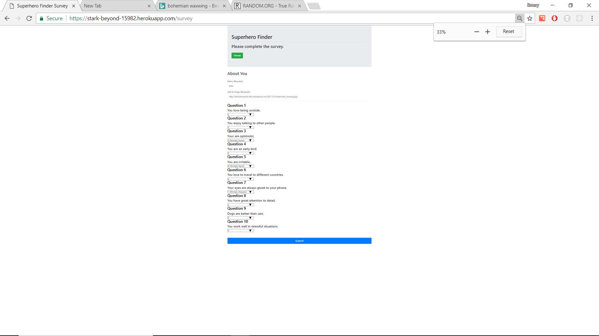

# Superhero Finder

### Purpose

This web application is part of a homework assignment in my coding bootcamp to showcase express.js and node.js functionality. I mixed things up by making the theme be centered around superheroes. Based on the user's response on the survey, a superhero will be assigned to the user.

### Deployed Website

https://stark-beyond-15982.herokuapp.com

### How to Use

Users would first be taken to a start screen with a button to click to go into the survey page. Next, the user will write their name and upload an image using an image URL. Next, the user will answer 10 survey questions using a scale between 1 and 5. The user finished by clicking the Submit button. The superhero that gets chosen will be based on the closest responses to the user generated responses. A modal will appear and let the user know which superhero is the best match. Links to the Superheroes with associated responses, as well as GitHub repo page will be displayed on the bottom of the home page.

### How it Works

A file with superhero data is used in connjunction with user-generated survey responses. The responses will be put in an array and this array will be compared with the seperhero data arrays. THe superhero chosen will be the one with the array of numbers that are closest to the array of numbers chosen by the user in the survey. Express.js is used for all the routing that goes on in the page. Since Express.js is normally run as an NPM package, Node.js is also required for it and for the server. This application uses Heroku for deployment.

### Screenshots

### Dependencies Used

body-parser, express, morgan, path

### Libraries Used

jQuery, Popper.js, Bootstrap
